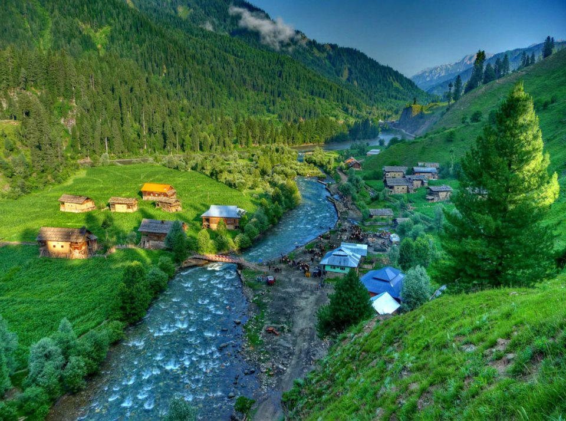
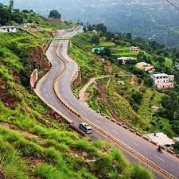

<!DOCTYPE html>
<html lang="en">
<head>
  <!-- Meta tags and title -->
  <!-- CSS only -->
  <link rel="stylesheet" href="https://stackpath.bootstrapcdn.com/bootstrap/5.0.0-alpha1/css/bootstrap.min.css">
</head>
<body>
  <!-- Navigation Bar -->
  <nav class="navbar navbar-expand-lg navbar-light bg-light fixed-top">
    <!-- Your navigation bar code here -->
  </nav>
  
  <!-- Carousel -->
  

    <!-- Carousel code here -->
  

  
  

    

      

        <h1>Welcome to the Travel Blog Post</h1>
        
Explore the breathtaking beauty of nature with our Travel Blog! This project is designed to inspire wanderlust and share the wonders of the world through captivating stories and stunning visuals. Join us on a journey to discover the most enchanting places on Earth.

      

      

        <h2>What We Offer</h2>
        
Our Travel Blog is more than just a collection of travel photos; it's an invitation to embark on an adventure of a lifetime. Here's what you can expect from this project:

        <ul>
          <li><strong>Visiting Areas:</strong> Explore some of the most iconic and serene locations, including Naran, Kaghan, Kashmir, and Skardu.</li>
          <li><strong>Pictures:</strong> Immerse yourself in the magic of nature through categories like Scenery, Trees, Shadows, and Winds.</li>
          <li><strong>Blog:</strong> Dive into in-depth travel stories, tips, and insights that will make your own journeys more rewarding.</li>
          <li><strong>Contact:</strong> Connect with us to share your travel experiences or ask questions about your next adventure.</li>
        </ul>
      

    

  

  
  <!-- Image Gallery -->
  

    <h2>Image Gallery</h2>
    

      

        

          
          

            
Beautiful Scenery in Kashmir.

          

        

      

      

        

          
          

            
Another Stunning View of Kashmir.

          

        

      

      

        

          
          

            
Enjoy the Beauty of Kashmir.

          

        

      

    

  

  
  <!-- Footer -->
  <footer class="container text-center">
    

    
&copy; 2023 Your Name

  </footer>
  
  <!-- JavaScript and Bootstrap dependencies -->
  
  
</body>
</html>
